<div align="center">

# 🧬 LMSIS
### Latent Metabolic State Inference System


*A Clinical Machine Learning Pipeline for Detecting Silent Concurrent Metabolic Dysfunction in Normal-BMI Adults*

[](https://github.com/mysticai11/TYPE2-PHENOTYPE/actions)
[](https://www.python.org/)
[](https://fastapi.tiangolo.com/)
[](https://vitejs.dev/)
[](LICENSE)

</div>

<br/>

> *"Millions of adults worldwide receive a clean bill of health simply because their Body Mass Index (BMI) falls within the normal range (18.5 ≤ BMI ≤ 24.9 kg/m²). However, BMI is blind to fat distribution and ectopic tissue accumulation. Underneath a healthy-looking exterior, a patient may carry a silent, severe dual metabolic burden—simultaneous insulin resistance and hepatic steatosis—invisible to traditional screening."*

---

## 🎯 The Clinical Paradigm Shift

**LMSIS** addresses this diagnostic gap by deploying a **Dual-Anchored Semi-Supervised Identifiable Variational Autoencoder (DA-SS-iVAE)**. It recovers a continuous 2D latent metabolic geometry from 14 routine blood biomarkers, validated against gold-standard FibroScan ultrasound elastography.

> [!IMPORTANT]
> LMSIS is not intended to diagnose MASLD or insulin resistance. Instead, it provides a non-invasive **risk-stratification framework** that identifies normal-weight individuals who may benefit from further metabolic evaluation (such as specialist referrals, FibroScan, or longitudinal tracking).

<div align="center">
  
</div>

---

## 📊 Benchmark Demolition & Clinical Validation

Our system is rigorously validated against gold-standard clinical indices, providing complete empirical transparency.

### 1. Predicting Liver Steatosis (FibroScan CAP)
> [!TIP]
> The LMSIS Z2 latent axis dominates all current clinical gold standards, achieving an AUROC of 0.841. Notably, NAFLD-LFS has a negative correlation in this population, meaning it actively misleads clinical judgement.

<div align="center">

| Model / Index | Spearman ρ | AUROC (≥ 248) | AUROC (≥ 268) | Clinical Verdict |
| :--- | :---: | :---: | :---: | :--- |
| **LMSIS VAE (Z2)** | **`0.607`** | **`0.841`** | **`0.833`** | 🟢 **State-of-the-Art Reference** |
| FLI (Fatty Liver Index) | `0.447` | `0.740` | `0.766` | 🟡 Suboptimal (High variance) |
| TyG (Triglyceride-Glucose) | `0.358` | `0.710` | `0.736` | 🟡 Moderate (Insulin-only proxy) |
| HSI (Hepatic Steatosis Index)| `0.111` | `0.587` | `0.557` | 🟠 Degraded (Near-Random) |
| NAFLD-LFS (Liver Fat Score)| `-0.069` | `0.509` | `0.512` | 🔴 **Inverse Association** |

</div>

<br/>

### 2. Conformal Safety Calibration
> [!WARNING]
> Under covariate shift, standard marginal calibration fails the highest-risk "Dual-Burden" subgroup (dropping to 81.6% coverage). Our **Mondrian calibration** successfully guarantees safe subgroup coverage (≥ 90%) across all populations.

<div align="center">

| Phenotypic Quadrant | Sample ($n$) | Marginal Coverage | Mondrian Coverage | Patient Safety Target |
| :--- | :---: | :---: | :---: | :---: |
| **Metabolically Healthy (MHNW)** | 168 | `98.2%` | **`98.2%`** | `90.0%` |
| **IR-Dominant** | 129 | `93.8%` | **`100.0%`** | `90.0%` |
| **Steatosis-Dominant** | 185 | `87.0%` | **`98.9%`** | `90.0%` |
| **Dual-Burden (High-Risk)** | 136 | `81.6%` ⚠️ | **`90.4%`** 🛡️ | `90.0%` |

</div>

<br/>

### 3. Causal Pharmacological Dissociation
We simulated the specific physiological pathways of Metformin, Statins, and Fibrates. The model perfectly disentangled the biological mechanisms (double dissociation), confirming structural identifiability.

<div align="center">

| Drug Class | Target Axis | Target $p$-value | Effect Size | Off-Target $p$-value | Mechanism |
| :--- | :---: | :---: | :---: | :---: | :--- |
| **Metformin** | **Z1 (IR)** | **< 1.3e-19** | **`1.000`** | `0.554` (NS) | ✔️ Exclusively targets Insulin Resistance |
| **Statin / Fibrate** | **Z2 (Steatosis)** | **< 2.2e-26** | **`0.888`** | `0.549` (NS) | ✔️ Exclusively targets Hepatic Steatosis |

</div>

---

## ⚙️ The Engine: DA-SS-iVAE Architecture

Standard VAEs fail metabolic phenotyping because their latent spaces are **non-identifiable** (arbitrary rotations achieve identical reconstruction error). LMSIS resolves this through three novel constraints:

1. 🧬 **iVAE Identifiability (Khemakhem et al., 2020):** Conditioning the prior `p(z|u)` on demographic auxiliaries `u` (age, sex, ancestry).
2. 🔗 **Dual Monotone Anchoring:** Constraining anchor networks using a Softplus activation on weights, forcing `z₁ → HOMA-IR` and `z₂ → CAP` to be strictly monotonic.
3. 🎭 **Semi-Supervised Masking:** Leveraging all 1,477 cohort participants for the Z₁ anchor, while safely masking the Z₂ anchor for the participants missing ultrasound FibroScan records.

---

## 🛠️ Technology Stack

<div align="center">

| Layer | Technologies Used |
| :--- | :--- |
| **Deep Learning Core** | PyTorch, NumPy, SciPy, Scikit-Learn |
| **Uncertainty & Coverage**| MAPIE, Scikit-Dimension |
| **Symbolic Regression** | PySR (Julia backend) |
| **API Backend** | FastAPI, Uvicorn, Pydantic v2 |
| **Interactive Dashboard** | React 19, Vite, Tailwind CSS, D3.js, Zustand, Framer Motion |

</div>

---

## 🚀 Getting Started

### 1. Installation & Environment
Clone the repository and install the strictly version-locked core dependencies:
```bash
git clone https://github.com/mysticai11/TYPE2-PHENOTYPE.git
cd TYPE2-PHENOTYPE
pip install -r requirements.txt
```

### 2. Verify System Integrity
Assert system safety, run integration tests, check monotonicity bounds, and verify VAE weight alignments:
```bash
python -m pytest test_integration.py -v
```

### 3. Launch the API & Dashboard
Open two separate terminals to spin up the system.

**Terminal 1 (FastAPI Backend):**
```bash
uvicorn backend.main:app --reload
# API available at http://127.0.0.1:8000/docs
```

**Terminal 2 (React Dashboard):**
```bash
cd frontend
npm install
npm run dev
# Dashboard available at http://localhost:5173
```

---

## 📈 Symbolic AI Interpretability

We mapped the "black-box" decoder using Symbolic Regression (`PySR`), recovering interpretable governing equations for the biological pathways:

| Biomarker | Discovered Symbolic Formula | Biological Interpretation |
| :--- | :--- | :--- |
| **HDL Cholesterol** | <code>hdl = -17.13 * (z₁ + z₂ + &#124;z₂&#124;) + 61.04</code> | Both resistance and steatosis actively suppress HDL. |
| **Atherogenic Index** | <code>aip = &#124;(z₁ + z₂ + 0.131) * (z₂ + 0.385)&#124; + z₂</code> | Cardiovascular risk scales non-linearly, peaking at Dual-Burden. |
| **AST:ALT Ratio** | <code>ast_alt = 11.59^z₂ * (4.64 - &#124;z₁ - z₂&#124;)</code> | Liver injury correlates exponentially with the Z2 Steatosis axis. |

---

## 📜 Repository Structure

```text
TYPE2-PHENOTYPE/
├── backend/                  # FastAPI (Endpoints: /infer, /compare, /export_pdf)
├── frontend/                 # React Dashboard (D3.js Atlas, Framer Motion UI)
├── models/                   # Serialized Checkpoints (ivae_best.pt, conformal_surface.pkl)
├── results/                  # Generated Figures, CSV validations, and PySR outputs
├── src_code/                 # Core Python Pipeline
│   ├── data/                 # NHANES multi-cycle loading & preprocessing
│   ├── model/                # VAE, Encoder, Decoder, Prior and Anchor definitions
│   ├── counterfactual/       # Riemannian geodesic solver & Brent's inversion
│   └── validation/           # Benchmarking, conformal testing & pharmacology PSM
└── test_integration.py       # Comprehensive CI/CD integration tests
```

---

> **LMSIS** — Built for the intersection of clinical insight and computational rigor.
