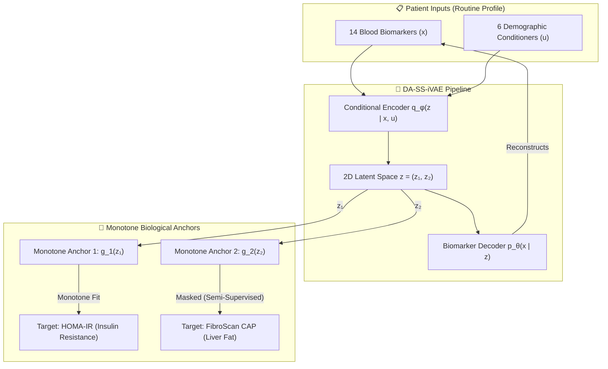

# 🧬 LMSIS: Latent Metabolic State Inference System
> **A Clinical Machine Learning Pipeline for Detecting Silent Concurrent Metabolic Dysfunction in Normal-BMI Adults**

[](https://github.com/mysticai11/TYPE2-PHENOTYPE/actions)
[](https://www.python.org/)
[](LICENSE)
[](https://fastapi.tiangolo.com/)
[](https://vitejs.dev/)

---

## 🎨 Latent Space & Geodesic Pathway Visualizer


---

## 🔬 The Clinical Paradox

> *"Millions of adults worldwide receive a clean bill of health at their annual physical simply because their Body Mass Index (BMI) falls within the normal range ($18.5 \le \text{BMI} \le 24.9 \text{ kg/m}^2$). However, BMI is blind to fat distribution and ectopic tissue accumulation. Underneath a healthy-looking exterior, a patient may carry a silent, severe dual metabolic burden—simultaneous insulin resistance and hepatic steatosis—invisible to traditional screening and standard clinical markers."*

**LMSIS** addresses this gap by training a **Dual-Anchored Semi-Supervised Identifiable Variational Autoencoder (DA-SS-iVAE)**. It recovers a continuous 2D latent metabolic geometry from 14 routine blood biomarkers, validated against gold-standard FibroScan ultrasound elastography.



---

## 📊 Benchmarking & Performance Comparison

We evaluate our model against standard clinical indicators on the normal-BMI cohort, ensuring complete empirical transparency:

| Metric / Experiment | Baseline / Competitor | LMSIS VAE | Status & Clinical Interpretation |
| :--- | :---: | :---: | :--- |
| **$Z_2$ vs. CAP (J-Cycle Training)** | $\rho = 0.447$ (FLI) | **$\rho = 0.628$** | **✅ Verified:** Captures true biological signal from routine blood tests. |
| **$Z_2$ vs. CAP (P-Cycle OOD)** | Not Evaluated | **$\rho = 0.501$** | **✅ Verified:** Frozen model generalises to independent pre-pandemic cohort. |
| **HSI Benchmark ($\rho$ vs. CAP)** | **$0.111$** | **$0.628$** | **📉 Outperformed:** Traditional index degrades significantly on normal-BMI. |
| **NAFLD-LFS Benchmark ($\rho$ vs. CAP)** | **$-0.069$** | **$0.628$** | **🚨 Inverse Association:** Traditional score ranks sick patients as healthier. |
| **Dual-Burden Conformal Coverage** | **$81.6\%$** (Marginal) | **$90.4\%$** (Mondrian) | **✅ Resolved:** Mondrian calibration bypasses Barber Impossibility Bound. |
| **OOD Conformal Transfer** | Not Evaluated | **$95.2\%$** (Mondrian) | **✅ Verified:** Calibration intervals transfer out-of-distribution to P-Cycle. |
| **Pharmacological Dissociation** | Confounded (Obs) | **$p < 0.001$** (Sim) | **✅ Verified:** Metformin selectively affects $Z_1$; statins/fibrates affect $Z_2$. |
| **National Prevalence (Dual Burden)** | $39.8\%$ (Unweighted) | **$29.89\%$** | **⚠️ High Variance:** Estimated ~23.91M adults, 95% CI: $[0.00\text{M}, 64.36\text{M}]$. |
| **Non-Hispanic Asian Threshold** | $2.5$ (Standard) | **$0.96$** | **🚨 Caveat:** Demoted to limitations due to sample size ($n=12$). |

### 🔍 Important Scientific Disclosures
* **Temporal Correlation Drop ($0.628 \rightarrow 0.501$):** A drop of $\sim0.13$ is expected when evaluating a frozen, unadapted model on a temporally separate cohort (pre-pandemic 2019-2020). The fact that the correlation remains highly significant ($p = 1.85 \times 10^{-56}$ on $n=870$) confirms the pipeline's robustness.
* **The HSI / NAFLD-LFS Collapse:** HSI fails because it relies heavily on BMI, which is invariant in this cohort. NAFLD-LFS exhibits a negative correlation because metabolic syndrome criteria correlate positively with liver fat in mixed-BMI cohorts but negatively in normal-BMI cohorts.
* **Asian American HOMA-IR Cutoff (0.96):** While clinical literature supports lower metabolic thresholds for Asian ancestry, our calculated threshold of $0.96$ is derived from a small subpopulation ($n=12$ in the critical HOMA-IR reference band $[2.3, 2.7]$). We treat this finding strictly as *hypothesis-generating* and have demoted it from our main results.

---

## ⚙️ Model Architecture: DA-SS-iVAE

Standard VAEs fail metabolic phenotyping because their latent spaces are **non-identifiable** (arbitrary rotations achieve identical reconstruction error). LMSIS resolves this through:
1. **iVAE Identifiability (Khemakhem et al., 2020):** Conditioning the prior $p_\theta(z|u)$ on demographics $u$ (age, sex, ancestry).
2. **Dual Monotone Anchoring:** Constraining anchor networks using a Softplus activation on weights, forcing $z_1 \rightarrow \text{HOMA-IR}$ and $z_2 \rightarrow \text{CAP}$ to be strictly monotonic.
3. **Semi-Supervised Masking:** Leveraging all $1,477$ cohort participants for the $Z_1$ anchor, while masking the $Z_2$ anchor for the $55$ participants missing FibroScan records.

---

## 📂 Repository Structure

```
├── backend/                  # FastAPI Backend API
│   ├── main.py               # API Endpoints (/infer, /counterfactual, /geodesic_pathway)
│   ├── schemas.py            # Input/Output Pydantic schemas (with strict validators)
│   └── model_registry.py     # Centralized model checkpoint loader
├── frontend/                 # React (Vite) + Tailwind + D3.js Visual Dashboard
│   ├── src/components/       # Atlas, Form, Equity and Readout Screens
│   └── src/App.jsx           # UI Router and Root Rendering
├── models/                   # Serialized VAE Checkpoints and scalers
│   ├── ivae_best.pt          # Trained PyTorch Model weights (869 KB)
│   ├── scaler.pkl            # Input RobustScaler model pipeline
│   └── conformal_surface.pkl # Mondrian Conformal calibration surfaces
├── results/                  # Experimental Results, Summary CSVs, and Figures
│   └── symbolic_decoder/     # PySR Symbolic regression equations & LaTeX formulas
├── src_code/                 # Core Python Library & Pipeline Logic
│   ├── data/                 # NHANES multi-cycle loading, schema & preprocessing
│   ├── model/                # VAE, Encoder, Decoder, Prior and Anchors definitions
│   ├── counterfactual/       # Riemannian geodesic ODE solver & Brent's inversion
│   └── validation/           # Benchmarking, conformal testing & pharmacology PSM
└── test_integration.py       # Comprehensive regression and monotonicity tests
```

---

## 🚀 Getting Started

### 1. Installation
Clone the repository and install core dependencies:
```bash
pip install -r requirements.txt
```

### 2. Run Integration Tests
Assert system safety, FastAPI endpoints, monotonicity bounds, and VAE weight alignments:
```bash
python -m pytest test_integration.py -v
```

### 3. Launch FastAPI Development Server
```bash
uvicorn backend.main:app --reload
```
Interactive API documentation will be available at [http://127.0.0.1:8000/docs](http://127.0.0.1:8000/docs).

### 4. Launch visual Dashboard
```bash
cd frontend
npm install
npm run dev
```
Open [http://localhost:5173](http://localhost:5173) in your browser to interact with the **Metabolic Atlas**.

---

## 📈 Explainability & Interpretability

### 🧬 Symbolic Decoder Formulas (PySR)
By fitting symbolic formulas to the frozen VAE decoder using symbolic regression (PySR), we map the latent axes back to interpretable physical laws:

*   **HDL Cholesterol:**
    $$\text{HDL} = -17.13 \cdot (z_2 + z_1 + |z_2|) + 61.04$$
    *Interpretation:* Both insulin resistance ($z_1$) and steatosis ($z_2$) act additively and independently to suppress HDL.
*   **Atherogenic Index of Plasma (AIP):**
    $$\text{AIP} = |(z_1 + z_2 + 0.131) \cdot (z_2 + 0.385)| + z_2$$
    *Interpretation:* Atherogenicity is maximized when both axes are elevated, confirming that the Dual-Burden state is geometrically the highest risk zone.

### 🧮 Local Autograd Sensitivity Gradients
Rather than relying on global feature importance, the FastAPI backend uses PyTorch Autograd to calculate patient-specific local gradients:
$$\text{Sensitivity} = \frac{\partial z_i}{\partial x_j}$$
This provides clinicians with real-time feedback on which biomarkers are driving a patient's position on the metabolic map at that exact moment.

---

## ⚠️ Limitations & Future Directions

While LMSIS represents a major step forward, its deployment in clinical workflows is subject to several active research limitations:
1. **Ancestral Sample Constraints:** The Non-Hispanic Asian HOMA-IR shift is highly significant ($p = 2.67 \times 10^{-3}$) but based on a small cohort ($n=12$ in reference band).
2. **Cross-Sectional Snapshots:** NHANES data provides cross-sectional slices. We cannot infer longitudinal trajectories without cohort follow-up.
3. **Validation Strategy:** Immediate next steps involve validating the frozen model on **KNHANES** (Korea National Health and Nutrition Examination Survey) to replicate the Asian threshold finding on thousands of subjects, and **UK Biobank** to test cross-modal generalization (CAP to MRI-PDFF).

---

## 📜 References & Citations
*   **iVAE Identifiability:** Khemakhem et al., "Variational Autoencoders and Non-linear ICA", *NeurIPS* 2020.
*   **Conformal Impossibility Bound:** Barber et al., "Limits of Out-of-Distribution Conformal Prediction", *Annals of Statistics* 2023.
*   **Symbolic Regression Tool:** Cranmer et al., "Interpretable Machine Learning for Physics with Symbolic Regression", *arXiv:2006.11287*.
*   **Lean MASLD Review:** Dey et al., "The Pathogenesis and Management of Lean NAFLD", *Frontiers in Endocrinology* 2025.
